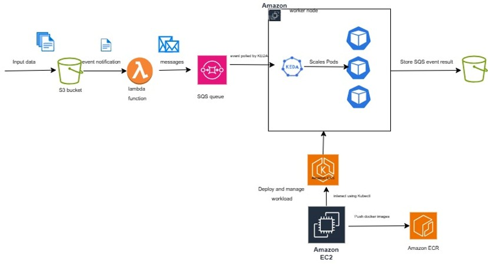
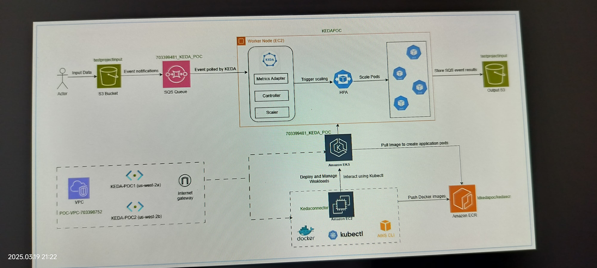

# Kubernetes Event-Driven Autoscaling (KEDA) on AWS EKS  
**Automatically scale workloads based on SQS queue depth**  

---

### 📖 Project Overview  
This project implements event-driven autoscaling on **Amazon EKS** using **KEDA (Kubernetes Event-Driven Autoscaling)**. The solution scales Kubernetes pods based on messages in an **Amazon SQS queue**, triggered by file uploads to an **S3 bucket**.  


## 🖥️ Project Architecture
<div align="center">
  
</div>

**Workflow**:  
1. Files uploaded to S3 trigger a **Lambda function**.  
2. Lambda reads `metadata.txt` to extract filenames and sends one message per file to SQS.  
3. **KEDA** monitors SQS queue depth.  
4. When messages exceed threshold (e.g., 5), KEDA scales the EKS deployment.  

**Core Components**:  
- **AWS**: EKS, S3, SQS, Lambda, EC2, IAM, VPC  
- **Kubernetes**: KEDA, IRSA (IAM Roles for Service Accounts)  
- **Tools**: Terraform (provisioning), Ansible (configuration), GitHub Actions (CI/CD)  

---

### ⚙️ Architecture  
  
1. **Input**: Files uploaded to S3 bucket.  
2. **Processing**:  
   - S3 event triggers Lambda.  
   - Lambda parses `metadata.txt` and sends filenames as SQS messages.  
3. **Scaling**:  
   - KEDA monitors SQS queue depth.  
   - Scales `keda-app-deployment` pods when messages > threshold.  
4. **Infrastructure**:  
   - EKS cluster in a VPC with public subnets.  
   - Non-cluster EC2 instance (`kedaconnector`) for cluster management.  
   - IRSA for secure pod-level AWS permissions.  

---


### 🖥️ Low level Architecture
<div align="center">
  
</div>


### ⚠️ Prerequisites  
1. **AWS Account** with permissions for:  
   - EKS, EC2, S3, SQS, Lambda, IAM.  
2. **Tools Installed**:  
   - `aws-cli`, `kubectl`, `terraform`, `docker`.  
3. **IAM Roles** (created upfront):  
   - **EKS Role**: `850075943_customEksRole` ([policies](#-iam-roles-and-policies)).  
   - **EC2 Role**: `850075940_ec2InstanceProfile` ([policies](#-iam-roles-and-policies)).  

---

### 🚀 Setup Steps  

#### 1. Infrastructure Provisioning (Terraform)  
Deploy AWS resources:  
```bash 
terraform init 
terraform apply -target=aws_vpc.keda_vpc 
terraform apply -target=aws_eks_cluster.keda_cluster 
